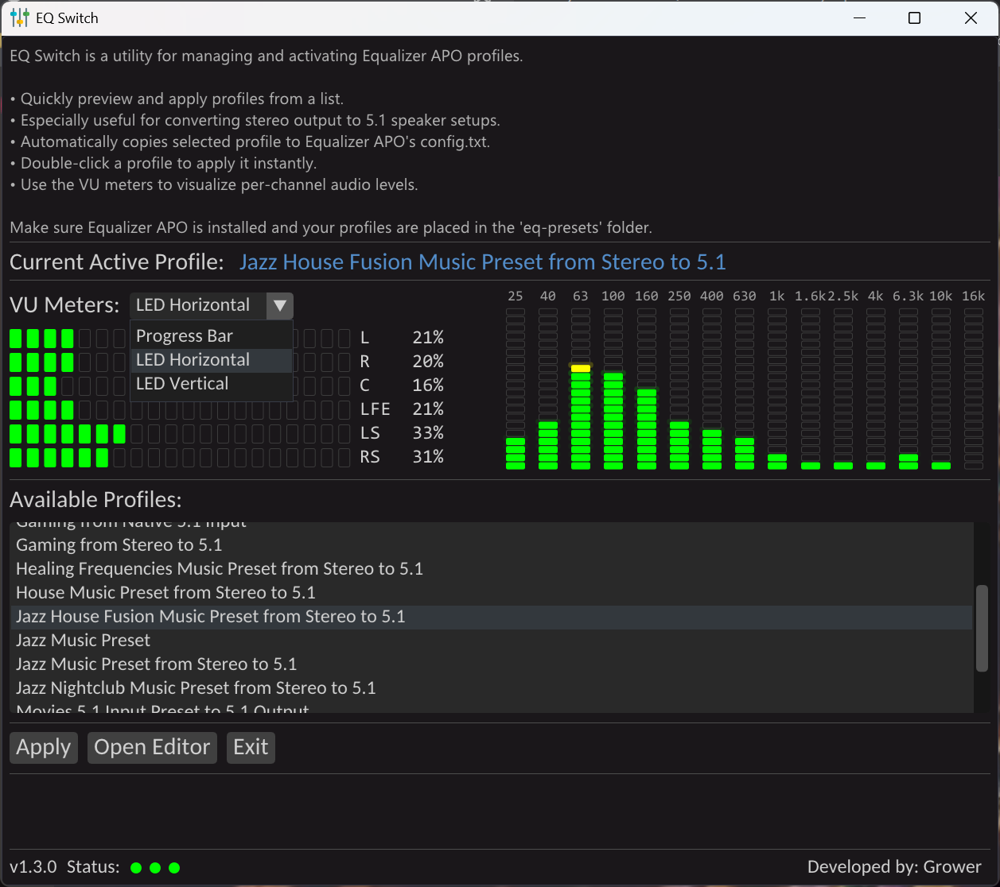

# 🎛️ EQ Switch

**EQ Switch** is a minimalist ImGui/DirectX11-based C++ desktop application that lets you easily switch between different [Equalizer APO](https://sourceforge.net/projects/equalizerapo/) profiles. It's designed for fast access to audio configurations, especially when working with multiple speaker setups like stereo, 5.1, or custom room correction profiles.



---

## ✨ Features

- 🎚️ **Real-Time Audio VU Meters**  
  Visualize levels for up to 6 channels using Progress Bars, LED-style Vertical or Horizontal meters.

- 🖱️ **Fast Profile Switching**  
  Easily switch Equalizer APO profiles with one click or double-click.

- 🎨 **Dark Modern Theme**  
  Includes a custom dark UI theme inspired by VS Code Dark Modern.

- 💾 **Prebuilt Profiles Included**  
  Comes with stereo-to-5.1 transformation profiles ready to use.

- 🧠 **Persistent Selection**  
  Keeps track of your current profile and scrolls to it on startup.

- 🔧 **Modular C++ Codebase**  
  Easily extensible—components like theming, fonts, meters, and audio capture are isolated in clean modules.

---

## 📦 Prebuilt Profiles

The project comes with a set of prebuilt Equalizer APO profiles, **primarily used for transforming stereo audio into 5.1 surround**. These profiles are located in the `eq-presets/` directory and can be customized or replaced as needed.

## 📦 Folder Structure

```
EQSwitch/
├── imgui/ # ImGui + backends (DX11/Win32)
├── src/
│ ├── main.cpp # WinMain entry and render loop
│ ├── gui/
│ │ └── EQSwitchWindow.{cpp,h}
│ ├── audio/
│ │ └── AudioCapture.{cpp,h}
│ ├── config/
│ │ └── ProfileManager.{cpp,h}
│ ├── utils/
│ │ ├── VUBuffer.{cpp,h}
│ │ └── Fonts.{cpp,h}
│ │ └── AppLauncher.{cpp,h}
│ │ └── ChannelLabels.{cpp,h}
│ │ └── SystemUtils.{cpp,h}
├── eq-presets/ # Your custom config .txt profiles
├── launch_editor.bat # Optional editor launcher
├── resources/ # Icons / resources
├── tasks.json # VSCode build tasks
├── c_cpp_properties.json
└── README.md
```
---
## Controls

- **Double-click** a profile in the list to apply
- **Use the dropdown** to switch VU meter style (Progress Bar / LED Horizontal / LED Vertical)
- **Apply button** to re-apply current profile manually
---

## 🛠️ Build Instructions

### ✅ Requirements

- Windows (x64)
- VSCode or `cl.exe` via Developer Command Prompt
- [ImGui](https://github.com/ocornut/imgui) (included locally)
- [Equalizer APO](https://sourceforge.net/projects/equalizerapo/) installed

### ⚙️ VSCode Build with `tasks.json`

The project comes with a preconfigured `tasks.json` for compiling with `cl.exe`. You must have VSCode’s C++ tools installed.

**To build:**

1. Install VSCode with C++ desktop development tools
2. Clone the repository.
2. Open VSCode from the “Developer Command Prompt for VS 2022”
3. Press `Ctrl+Shift+B` to build the project
4. Run the resulting `EQSwitch.exe`

---

## 🗂️ Config Setup

Make sure your directory structure matches this:

- `eq-presets/` — contains `.txt` config profiles with a comment like `# EQ Profile: My Preset`
- `C:\Program Files\EqualizerAPO\config\config.txt` — target config for active profile

Each profile file should include a line:

```text
# EQ Profile: My Preset Name
```

## 💡 Usage

- Run the compiled executable.
- Use the profile list to select and apply an Equalizer APO profile.
- VU meters update in real-time, displaying audio levels for each channel.
- Double-click a profile to apply it.
- Click "Apply" to manually activate the selected profile.
- Press `ESC` or close the window to exit.

---

## 💡 Tips

- Add your fonts in `utils/Fonts.cpp`
- Add an icon in `resources/resource.h` and include it via `LoadIcon(...)`
- Make sure to run the app with proper permissions if needed to restart the Equalizer APO service

## 📃 License

MIT — feel free to use, modify, and redistribute.
Credit to [ImGui](https://github.com/ocornut/imgui) and [Equalizer APO](https://sourceforge.net/projects/equalizerapo/).

## 🙏 Credits

- Developed by Matej Arh
- Special thanks to the [Equalizer APO](https://sourceforge.net/projects/equalizerapo/) community and [ImGui](https://github.com/ocornut/imgui) by Omar Cornut.
- Fonts: Carlito (from Windows font directory)

### 📋 Changelog

#### v1.1.0 – Enhanced GUI and Theming
- 🆕 Added support for switching between VU meter modes: **Progress Bar**, **LED Horizontal**, and **LED Vertical**
- 🎨 Refined **Dark Modern** ImGui theme (VS Code–inspired)
- 🧱 Introduced modular **VuMeters** class
- 💡 Customizable font styles and layout improvements
- ✅ Combo box now aligns properly and uses small font
- 🛠️ Fixed profile selection issue and added auto-scroll behavior

#### v1.0.0 – Initial Release
- 🎚️ VU meters with Progress Bar visualization
- 🔁 Equalizer APO profile switching with double-click
- 🖼️ Fullscreen DX11/Win32 GUI with ImGui
- 💾 Prebuilt stereo-to-5.1 Equalizer APO profiles included
- 🧩 Modular C++ architecture (AudioCapture, GUI, Config, VU, Theme)