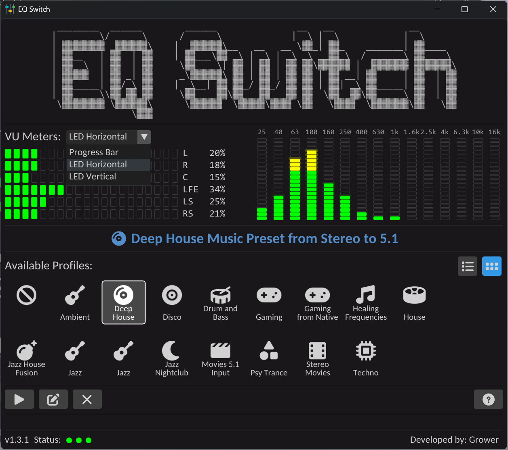

# 🎛️ EQ Switch

**EQ Switch** is a minimalist ImGui/DirectX11-based C++ desktop application that lets you easily switch between different [Equalizer APO](https://sourceforge.net/projects/equalizerapo/) profiles. It's designed for fast access to audio configurations, especially when working with multiple speaker setups like stereo, 5.1, or custom room correction profiles.



---

## ✨ Features

- Fast GUI switching for Equalizer APO profiles
- VU meter visualization per audio channel (6-channel support by default)
- Automatically loads profiles from a specified directory
- Scrollable and selectable profile list with double-click to apply
- Optional profile editing via external config editor
- Small footprint, no installation required

---

## 📦 Prebuilt Profiles

The project comes with a set of prebuilt Equalizer APO profiles, **primarily used for transforming stereo audio into 5.1 surround**. These profiles are located in the `eq-presets/` directory and can be customized or replaced as needed.

## 📦 Folder Structure

```
EQSwitch/
├── imgui/ # ImGui + backends (DX11/Win32)
├── src/
│ ├── main.cpp # WinMain entry and render loop
│ ├── gui/
│ │ └── EQSwitchWindow.{cpp,h}
│ ├── audio/
│ │ └── AudioCapture.{cpp,h}
│ ├── config/
│ │ └── ProfileManager.{cpp,h}
│ ├── utils/
│ │ ├── VUBuffer.{cpp,h}
│ │ └── Fonts.{cpp,h}
│ │ └── AppLauncher.{cpp,h}
│ │ └── ChannelLabels.{cpp,h}
│ │ └── SystemUtils.{cpp,h}
├── eq-presets/ # Your custom config .txt profiles
├── launch_editor.bat # Optional editor launcher
├── resources/ # Icons / resources
├── tasks.json # VSCode build tasks
├── c_cpp_properties.json
└── README.md
```

---

## 🛠️ Build Instructions

### ✅ Requirements

- Windows (x64)
- Visual Studio or `cl.exe` via Developer Command Prompt
- [ImGui](https://github.com/ocornut/imgui) (included locally)
- [Equalizer APO](https://sourceforge.net/projects/equalizerapo/) installed

### ⚙️ VSCode Build with `tasks.json`

The project comes with a preconfigured `tasks.json` for compiling with `cl.exe`. You must have Visual Studio’s C++ tools installed.

**To build:**

1. Open VSCode from the “Developer Command Prompt for VS 2022”
2. Press `Ctrl+Shift+B` to build the project
3. Run the resulting `EQSwitch.exe`

---

## 🗂️ Config Setup

Make sure your directory structure matches this:

- `eq-presets/` — contains `.txt` config profiles with a comment like `# EQ Profile: My Preset`
- `C:\Program Files\EqualizerAPO\config\config.txt` — target config for active profile

Each profile file should include a line:
```text
# EQ Profile: My Preset Name
```

## 💡 Usage

- Run the compiled executable.
- Use the profile list to select and apply an Equalizer APO profile.
- VU meters update in real-time, displaying audio levels for each channel.
- Double-click a profile to apply it.
- Click "Apply" to manually activate the selected profile.
- Press `ESC` or close the window to exit.

---

## 💡 Tips

- Add your fonts in `utils/Fonts.cpp`
- Add an icon in `resources/resource.h` and include it via `LoadIcon(...)`
- Make sure to run the app with proper permissions if needed to restart the Equalizer APO service

## 📃 License
MIT — feel free to use, modify, and redistribute.
Credit to [ImGui](https://github.com/ocornut/imgui) and [Equalizer APO](https://sourceforge.net/projects/equalizerapo/).

## 🙏 Credits
- Developed by Matej Arh
- Special thanks to the [Equalizer APO](https://sourceforge.net/projects/equalizerapo/) community and [ImGui](https://github.com/ocornut/imgui) by Omar Cornut.
- Fonts: Carlito (from Windows font directory)